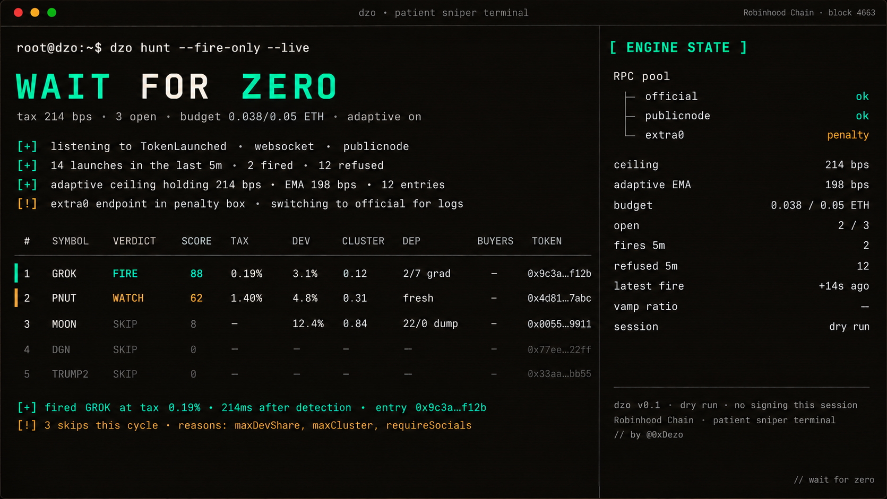

# DZO


**Decay · Zero · Open** — the patient sniper terminal for pons v2 on Robinhood Chain.
Local, open, non-custodial, dry run by default.

`wait for zero`

<!-- $DZO · 0x... (fill in after launch) -->

---

Every pons v2 launch on Robinhood Chain opens behind a 99% tax that decays to zero in three seconds. Racing the first block hands the buy to the creator. The chain seals a block every 100ms, orders by arrival, and has no gas auction, so the only edge left is **when**. DZO reads a launch in one multicall, scores it with rules you can read, waits at full draw until the tax is under your ceiling (dynamically adjusted from your rolling entries), and releases. Then it backtests every rule against yesterday's chain so you know what your defaults would have done.

## Features

- **SQLite deployer index** in `data/deployers.db` — incremental catch-up from last block, cold start in <2s
- **Cluster fingerprint 2.0** — similarity across dev-buy wei (±5%), text n-grams on description, temporal windowing; catches farms that randomize their numbers
- **Historical backtest** — `dzo replay --from BLOCK --to BLOCK` replays a full day of launches through the engine, real `quoteSell` marks, outputs P&L + confusion matrix
- **Tunable score weights** — `config/scoring.yaml`, every weight editable without rebuild; `dzo tune` runs grid search over recent 24h and prints an optimal set
- **Adaptive tax ceiling** — EMA of last 50 successful entries, tightens or relaxes automatically (`SNIPE_ADAPTIVE_TAX=off` to disable)
- **Health-scored RPC pool** — 4+ endpoints, per-method routing by p95 latency + refuse rate over a rolling window
- **Multi-wallet planner** (opt-in) — strict wallet (score ≥85) + loose wallet (score ≥60), independent budgets, single session
- **Two-way Telegram** — reply `close 0xabc` in Telegram, engine closes the position

Wait-do-not-race philosophy, four walls around a live session, dry-run default — all on by default.

## The problem, what DZO does, the command

| The problem | What DZO does | Command |
|---|---|---|
| 24,000 launches a day, 559 graduate | one multicall per launch: dev buy, creator tax, fee recipient, declared bundle, deployer record, launch-farm cluster score, curve progress, then a 0–100 score with reasons | `hunt` · `board` |
| the first second costs 99% | polls `currentSnipeTaxBps` for your address every 150ms; adaptive ceiling; measured entries at 0.18–0.31% tax | `snipe` |
| "did these defaults ever work?" | replays every launch in a block range through the current rules; outputs P&L, hit/miss, best-worst launches | `replay` |
| "which weights actually predict graduation?" | grid search over score weights against a labeled historical window | `tune` |
| "who is getting paid on this token?" | reads the fee escrow's own `Credited`/`Claimed` events: recipient, accrued, every claim with a timestamp | `fees` |
| "has this deployer ever graduated anything?" | every launch by the address in the window with its phase; served from local SQLite | `dev` |
| following one launch by hand | curve fill, buyers, flow and the opening tax every 5s, then the pool price | `watch` |
| selling after graduation | routes by phase: curve while trading, Uniswap v4 pool after, refuses during the swept gap | `sell` |
| your own creator fees | pending balance in the escrow and a one-command claim | `wallet` · `claim` |

## Install

Node 20 or newer. Three ways, all local.

```bash
# 1. a checkout you can read and edit
git clone https://github.com/Dezo/dzo && cd dzo
npm install
cp .env.example .env
npx dzo doctor

# 2. straight from GitHub, no clone
npm install -g github:Dezo/dzo
dzo doctor

# 3. inside the checkout, without the bin
npm run doctor   ·   npm run hunt   ·   npm run board
```

On Windows the checkout carries three launchers: `start-hunt.cmd`, `start-snipe.cmd` (dry run) and `start-board.cmd`. Double-click one; it installs dependencies on first run, copies `.env.example` to `.env` when there is none, and starts that command. With Windows Terminal set as default terminal app the links in the output are clickable.

`.env` works out of the box on the public RPC. No key is needed for `doctor`, `hunt`, `watch`, `scan`, `fees`, `dev`, `positions`, `replay`, or any dry run. `PRIVATE_KEY` is needed only for `--live`, `sell`, `wallet` and `claim`.

| | |
|---|---|
| Required | Node ≥ 20 |
| Runtime dependencies | `viem`, `commander`, `ws`, `better-sqlite3`, `js-yaml` |
| For live trades | `PRIVATE_KEY` in `.env` and ETH on Robinhood Chain (bridge at robinhood.com/chain) |
| Detection | subscription over publicnode's free websocket, out of the box; `RPC_WS_URL=off` for 300ms polling, or your own `wss://` |
| Public RPCs | health-scored pool: publicnode (state reads, no `eth_getLogs`), official Robinhood RPC (logs), plus any endpoints you add in `RPC_URL_EXTRA`. Per-method routing, one gate: `RPC_IN_FLIGHT=3`, `RPC_SPACING_MS=50`, `RPC_LOGS_SPACING_MS=400`. Set `RPC_URL=` a private provider to carry everything |

## Sixty seconds

```bash
dzo doctor --probe     # is the chain there, are the pons numbers what we think, does the v4 quoter answer
dzo hunt               # watch launches arrive with a score and reasons
dzo board              # the same engine behind a page on 127.0.0.1:4663, dry run
dzo snipe              # dry run in the terminal: pass reasons, draw, FIRE, marks, exits
dzo replay --last 24h  # rerun yesterday through the current rules, print P&L
dzo snipe --live       # after you have watched it, and replay showed green
```
  

## Commands

| Command | What it does | Key |
|---|---|---|
| `doctor [--probe]` | RPC, chain id, live pons parameters, optional pool probe | no |
| `hunt` | live feed of launches with a score and reasons; `--json` for pipelines | no |
| `board` | the engine behind a local web page with controls | `--live` only |
| `snipe` | auto-buy launches that pass the rules, manage exits | `--live` only |
| `replay <range>` | rerun a historical block range through the current rules; P&L, confusion matrix | no |
| `tune <range>` | grid search score weights on a labeled window; prints top configs | no |
| `watch <token>` | follow one token: curve fill, flow, tax, then the pool price | no |
| `scan <token>` | everything on chain about one token | no |
| `fees <token>` | who is paid on a token and every claim | no |
| `dev <address>` | every launch by one deployer with its phase | no |
| `buy <token> <eth>` | buy on the curve or the pool | `--live` only |
| `sell <token> [pct]` | sell a share of your balance wherever the token trades | yes |
| `positions` | open and closed positions with live marks | no |
| `wallet` | the signer: address, balance, unclaimed fees | yes |
| `claim` | claim your creator fees from the escrow | `--live` only |

Every flag and environment variable: [`docs/COMMANDS.md`](docs/COMMANDS.md).

## `hunt`

One card per launch, a follow-up line at +15s and +60s. Every field is a chain read, not an API:

- **dev buy** from the curve's `CurveBuy` events in the launch transaction, as a share of the 1B supply
- **creator tax and fee recipient** from the factory record; "third party" means the fees do not go to the deployer (the builder/KOL deal)
- **exempt wallets:** addresses declared exempt from the opening tax in the launch calldata (the declared bundle)
- **deployer:** prior launches in ~11h and how many graduated, served from local SQLite
- **fingerprint 2.0:** cluster score across dev-buy wei (±5%), tax, links, description n-grams, from other fresh wallets inside 30 minutes; scores a farm even when it randomizes numbers
- **curve:** real quote in / graduation threshold, FDV in the pair asset (ETH, USDG, or a stock token), and the opening tax right now

```bash
dzo hunt --fire-only              # only FIRE verdicts
dzo hunt --min-score 70 --json    # JSON lines for your own pipeline
dzo hunt --no-follow --for 300    # cards only, stop after five minutes
```

## `board`

```bash
dzo board            # http://127.0.0.1:4663, dry run
dzo board --live
```

The engine and a page to watch it. Opens as a feed: launches arrive, get scored and explained, and nothing fires until you press `start demo` (dry run) or, with `--live`, arm live sniping. Click a launch for the full read: links to pons, the explorer, Axiom and FOMO, description, every rule that refused it, every scoring line. `close now` sells a position at the current quote. Five rules have steppers and change the running engine. A pulse every 10s tells a quiet chain from a dead engine. `p` start/stop, `f` fire filter, `/` search, `esc` close. It binds loopback, cannot buy on demand, and `--live` is a launch flag, not a button. Full manual: [`docs/BOARD.md`](docs/BOARD.md).

## `snipe`

Detect → read → decide → wait at full draw → release → mark every 5s → exit. Dry run unless `--live`.

```bash
dzo snipe                                 # dry run with the defaults from .env
dzo snipe --eth 0.02 --min-score 70       # bigger shots, stricter score
dzo snipe --keyword "grok|claude"         # only launches whose name/symbol/description match
dzo snipe --deployer 0xabc… 0xdef…        # only these deployers
dzo snipe --allow-pairs                   # also USDG and stock-token pairs
dzo snipe --adaptive-off                  # disable adaptive ceiling for this session
dzo snipe --wallets strict,loose          # multi-wallet planner (see docs/STRATEGY.md)
dzo snipe --live                          # sign and send
```

Every pass prints the rule that refused the launch. A launch that declared four wallets exempt from the opening tax is refused by the defaults even when everything else looks good. Relax `maxExemptWallets` on purpose, or not.

**Exits:** take profit +80%, stop loss −35%, trailing 25% below the peak, max hold 45 min. Marks are real quotes for the whole position. Four walls around a live session: a confirmation that prints your address, balance and limits and waits for you to type `arm`; the size per buy; the position cap; and a session budget (`--budget`, 0.05 ETH by default) after which nothing fires, whatever the score. Rules, score, and where every number comes from: [`docs/STRATEGY.md`](docs/STRATEGY.md); what can go wrong: [`docs/SAFETY.md`](docs/SAFETY.md).

## `replay` — the honest defense

```bash
dzo replay --last 24h                     # yesterday, current rules
dzo replay --from 52526287 --to 53396287  # any block range
dzo replay --rules custom.yaml            # test alternative rule sets
dzo replay --csv out.csv                  # every decision as a row
```

Replay is not a simulator. It re-runs the actual detection → enrichment → decision path against historical logs, then marks entries with real `quoteSell` values from that block, and outputs:

- total fires, total wins, total losses, net P&L in ETH
- confusion matrix: `FIRE→graduated` / `FIRE→dumped` / `SKIP→graduated` / `SKIP→dumped`
- top 5 correct fires, top 5 avoided, top 5 mistakes (with the rule that led to each)
- distribution of entry tax (should center under your ceiling)

If your rules produce net-negative replay P&L on the last 24h you know before spending a single wei live.

## `tune` — where the weights come from

```bash
dzo tune --last 24h --iter 200 --seed 42
```

Grid search over score weights within safe bounds against the last labeled window (launches whose fate — graduated or dumped — is already known). Prints top 5 weight sets by net P&L and by hit-rate. Copy the one you like into `config/scoring.yaml`.

## `fees`, `watch`, `scan`, `dev`

```bash
dzo watch 0x0da7…45ac   # one line every 5s: curve bar, flow, taxed buys, price; the pool after graduation
dzo scan  0x0da7…45ac   # one token: launch, dev buy, exempt wallets, links, fees, deployer, curve activity
dzo dev   0xbBa6…AD4c   # one deployer: every launch in the window with its phase (served from local SQLite)
dzo fees  0x0da7…45ac   # who is paid, accrued from curve and pool, every claim
```

## `buy`, `sell`, `positions`, `wallet`, `claim`

```bash
dzo buy  <token> 0.01          # curve before graduation, v4 pool after; dry run
dzo sell <token> 50 --live     # sell half of your balance wherever the token trades
dzo positions                  # open and closed, marked live
dzo wallet                     # address, ETH, unclaimed creator fees
dzo claim --live               # take the fees out of the escrow
```

## How it works

- **Detection** is a websocket subscription to the factory's `TokenLaunched` log (publicnode, free), with a watchdog: if the socket goes silent for 45s the feed re-subscribes and polls block ranges alongside until the socket delivers again, so the feed never dies for good. There is no mempool to watch: the sequencer broadcasts blocks it has already built.
- **Enrichment** is one `aggregate3` through the canonical Multicall3 (`0xcA11…CA11`) plus the launch transaction, receipt and block, all through one RPC gate that routes each method to an endpoint that serves it and keeps both from answering 429.
- **Deployer records** come from a local SQLite (`data/deployers.db`), populated once and updated incrementally by the live feed. Cold start is under 2s.
- **Cluster fingerprint** compares each new launch against the last 30 minutes of launches on multiple axes: dev-buy proximity, tax equality, link equality, description Jaccard similarity, exempt-count equality, temporal density. Score is the weighted sum, above 0.7 = cluster hit.
- **Curve math** is the protocol's own integer order (`PonsV2BondingCurve.buy/sell`), so `minTokensOut` is computed with the rounding the contract uses.
- **After graduation** the token trades in a Uniswap v4 pool keyed by the pair token and tick spacing the factory recorded for that launch. Quotes come from `V4Quoter`; swaps go through `UniversalRouter V4_SWAP` command, and the router's parameter layout is settled by simulation before the first live swap.
- **Adaptive ceiling** is an EMA over the last N (default 50) successful entries' realized tax. It tightens the ceiling toward the observed median when latency is stable, and loosens it back to the configured max when misses grow.

More in [`docs/ARCHITECTURE.md`](docs/ARCHITECTURE.md), what can go wrong in [`docs/SAFETY.md`](docs/SAFETY.md).

## Numbers behind the defaults (2026-09-03, mainnet)

| | |
|---|---|
| opening tax | 9,900 bps at t=0, window 3s (`snipeTaxStartBps`, `snipeTaxSeconds`) |
| launch fee | 0.0005 ETH |
| launches / graduations, 24h | 24,462 / 559 |
| tempo | 56–152 launches per 3,000 blocks (~5 min) |
| graduation | 4.2 ETH real quote against a 1.68 ETH phantom reserve; 28.57% of supply reserved for the pool |
| dry-run entries | tax 0.18–0.31%, 1.1–1.7s after WS detection |
| public RPC | 8 parallel calls pass, 16 → half rejected, a batch of 12 → rejected; 2 calls every 100ms → zero rejections |

## Tests

```bash
npm test
```

Twenty-four checks, no network: the curve quote reproduces the 3.00% dev buy that 0.0535 ETH gives on a fresh curve; round trips lose more than the fee; the opening-tax cap; clamped fills; the score on a builder-shaped launch and on a serial deployer; the sniper's refusals; the launch-farm cluster fingerprint; the unreadable-launch path; the enrichment limiter; the deployer index (SQLite); v4 pool ids and both router param layouts; every exit rule; the adaptive-ceiling EMA; the replay engine over a fixture; the tune grid search finds the seeded optimum.

## FAQ

**Is it safe to run?** Default is a dry run and every command says so. Nothing leaves your machine except JSON-RPC to the endpoint you configured. Read [`docs/SAFETY.md`](docs/SAFETY.md) before `--live`.

**Why did it pass a launch that went 10x?** The pass line names the rule. The defaults refuse declared bundles, heavy dev buys, serial deployers, launch farms and launches without socials; a 10x can come from any of those. Change the rule on purpose from the board or the flags. If a whole class of rules seems wrong, `tune` will tell you.

**Why is a fresh entry marked −10%?** Marks are real sell quotes for the whole position: they include the 1% fee, the creator tax and price impact. That is the round trip, not a loss yet.

**Does it front-run?** No. There is no mempool and no priority fee on this chain; DZO waits for the opening tax to decay and buys at arrival order.

**Can I use my own RPC?** Set `RPC_URL` and, for subscriptions, `RPC_WS_URL`. Raise `RPC_IN_FLIGHT` and lower `RPC_SPACING_MS` on a private endpoint. Add extras in `RPC_URL_EXTRA`.

## Protocol references

| Source | What is used |
|---|---|
| ponsdotdev/ponsfamily · docs.ponsfamily.com/v2 | contract addresses, ABIs, curve fee order, graduation phases |
| Uniswap v4 periphery · universal-router | Actions, Commands, `ExactInputSingleParams`, the Robinhood Chain deployment addresses |
| Robinhood Chain docs | RPC, sequencer model |

DZO is independent of pons, Uniswap and Robinhood. It refers to the network as "Robinhood Chain" and uses none of their marks. The zero-in-a-target monogram and the terminal aesthetic are its own drawings.

## License

MIT. Keep the dry run on until `replay` shows green for a session.

---

*wait for zero* — [@Dezo](https://x.com/0xDezo)
