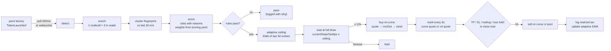

# Architecture

DZO is a single Node process. No database server, no daemon: `data/` holds a small SQLite for the deployer index and one JSON for positions, and every number on screen was read from Robinhood Chain in the last few seconds.

```
src/
├── cli.ts                  doctor · hunt · watch · scan · fees · dev · replay · tune
├── cli-trade.ts            commands that can move money: snipe · buy · sell · positions · wallet · claim · board (dry run by default)
├── chain.ts                chain 4663, contract addresses, the RPC gate factory, optional websocket
├── score.ts                rule-based 0–100 score with reasons; loads weights from config/scoring.yaml
├── snipe.ts                the engine: decide → wait for the opening tax → buy → mark every 5s → exit; pause, resume, close
├── view.ts                 shared terminal rendering: cards, tables, colors, links
├── abi/                    pons v2 (factory, curve, token, escrow, launch router) · Uniswap v4 (router, quoter, state view, permit2) · Multicall3
├── pons/
│   ├── launches.ts         detection: websocket subscription or 300ms block-range polling; backfill; find one launch
│   ├── enrich.ts           one Multicall3 + three tx reads per launch: metadata, factory record, curve state, dev buy, exemptions
│   ├── curve.ts            constant-product math in the protocol's integer order; quotes; the opening-tax cap
│   ├── deployerIndex.ts    SQLite-backed index; who launched what; live updates; the enrichment limiter
│   ├── fingerprint.ts      cluster fingerprint 2.0: dev-buy proximity, tax equality, links equality, description Jaccard, temporal density
│   ├── fees.ts             creator-fee forensics from the escrow's own Credited / Claimed events
│   ├── dev.ts              deployer history for `dev` and `scan`
│   └── replay.ts           historical replay: log-range → enrich → decide → mark with quoteSell of that block → P&L
├── trade/
│   ├── curveTrade.ts       buy / sell on the bonding curve
│   ├── poolTrade.ts        buy / sell on the graduated Uniswap v4 pool; route by phase; live valuation
│   ├── v4.ts               pool key from the factory record, pool id, StateView, V4Quoter, UniversalRouter calldata (both layouts)
│   ├── positions.ts        JSON store and the pure exit-rule function
│   ├── wallet.ts           the only file that touches PRIVATE_KEY
│   └── planner.ts          multi-wallet planner: route a fire to one wallet according to its threshold
├── board/                  loopback HTTP + SSE + one HTML page; four POST verbs into the engine
├── alerts/
│   ├── telegram.ts         optional Bot API notifications on fire / exit; optional two-way commands (close, pause, resume)
│   └── discord.ts          optional webhook notifications
└── util/
    ├── env.ts              env loader, defaults, validation
    ├── fmt.ts              formatting, ETH/USD, symbol/contract links, tiny colors
    ├── rpcGate.ts          health-scored RPC pool: capabilities per endpoint, p95 latency + refuse rate, per-method routing
    ├── retry.ts            retry-with-wait; cooldown after 429; penalty box per endpoint
    ├── adaptiveTax.ts      EMA of last N successful entries; tightens / relaxes SNIPE_MAX_TAX_BPS
    ├── config.ts           loads config/scoring.yaml with schema validation
    └── wordmark.ts         DZO ASCII wordmark for the terminal
```

## Data flow of one launch



## Why these choices

- **Subscription first, polling second.** Robinhood Chain has no public mempool; the sequencer orders first-come-first-served and broadcasts blocks it has already built. Earliest anyone can see a launch is the block it landed in. publicnode runs a free websocket, so by default a launch arrives as a log push; `RPC_WS_URL=off` falls back to a 300ms block-range poll that slows itself down when refused.
- **Health-scored endpoint pool, one gate, no JSON-RPC batches.** The official RPC returns 429 above roughly eight concurrent calls, counts every call inside a batch array, meters `eth_getLogs` separately and challenges noisy clients; publicnode is fast and generous but refuses `eth_getLogs`. `util/rpcGate.ts` keeps every endpoint with a capability set and a rolling health score (p95 latency + refuse rate over the last 60s), routes each method to the highest-scored healthy endpoint that serves it, with bounded concurrency, minimum spacing (tighter for logs), a process-wide cooldown after a 429, a penalty box per endpoint, and retries that wait instead of failing. Fifteen contract reads per launch go through canonical Multicall3 as one `eth_call`.
- **Persistent deployer index.** SQLite (`data/deployers.db`). First run backfills the last 400,000 blocks in the background; every launch after that is a single insert. Cold start after the first run is under 2s. Keeping this on disk avoids a startup burst of getLogs on the public RPC.
- **Cluster fingerprint 2.0.** Exact-match fingerprints (dev-buy wei + tax + links) miss farms that vary dev-buy by 3% or rotate their link. The cluster version scores similarity per axis (dev-buy within ±5%, tax exact, links Jaccard, description n-grams, exempt-count exact, temporal density), sums weighted, and flags anything above 0.7. Two axes at 1.0 with three at 0.5 clears the bar.
- **Wait, do not race.** The curve charges a 99% opening tax that decays to zero in 3 seconds. The engine polls the tax for its own recipient every 150ms and fires when it is under the ceiling. Measured entries land 190–200ms after detection at 0–0.19%.
- **Adaptive ceiling.** Instead of a fixed 3%, `util/adaptiveTax.ts` tracks the EMA of realized tax on the last N (default 50) successful entries. When observed median stays stable, ceiling tightens toward it; when a run of misses accumulates, ceiling relaxes back to the configured max. Off by default with `SNIPE_ADAPTIVE_TAX=off` to use a fixed ceiling instead.
- **Quotes in the protocol's own integer order.** `pons/curve.ts` reproduces `PonsV2BondingCurve.buy/sell` step by step so `minTokensOut` is computed from the same rounding the contract will use.
- **Two venues, one router decision.** Before graduation the curve is the venue. After graduation the token trades in a Uniswap v4 pool behind the pons hook, keyed by the pair token and tick spacing the factory recorded for that launch. `sellAnywhere` reads the phase from the factory and refuses to trade during the swept gap between the two.
- **Backtest as a first-class feature.** `pons/replay.ts` reruns any historical block range through the exact same detect → enrich → decide path, then marks each entry with a `quoteSell` executed against that block, and writes a P&L + confusion matrix. This is the only honest defense of the defaults: if replay is red on yesterday, live is not the answer.
- **Score weights are data.** `score.ts` reads `config/scoring.yaml` at start. Any weight can change without rebuilding. `dzo tune` runs a bounded grid search over the last labeled window and prints the top weight sets by net P&L and by hit-rate.
- **The board is a view with four verbs.** It binds 127.0.0.1, streams engine events, and accepts pause, resume, close a position, and edit a bounded rule. It has no route that buys; `--live` is a launch flag.

## What is deliberately not here

Copy trading, limit orders, bundling, a hosted bot, MEV tricks, priority fees (there are none on this chain). The chain has no priority-fee ordering to exploit and the product has no server to trust.

## Core principles

- wait, don't race
- four walls around `--live`
- dry-run default
- one-multicall enrichment
- reasons-with-refusals
- deployer index on disk (SQLite)
- fingerprint by similarity clustering
- backtest is a first-class command
- score weights in a YAML file
- adaptive tax ceiling
- health-scored RPC endpoints, per-method routed
- opt-in multi-wallet planner
